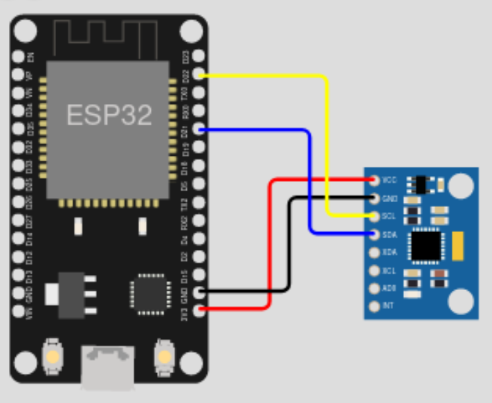

# Obsah

 - Hardware
 - Software
 - Průběh záznamu
 - Výsledky - přehled grafů
 - Možnosti, návrhy na zlepšení

# Hardware

 - ESP32
 - MPU9250 (MPU6050)
 - I2C, UART

# Schéma zapojení

{ width=75% }

# Software

 - C++ (termios, termbits)
 - python (matplotlib, imufusion)

# Průběh záznamu dat

 (a) board.conf
 (b) program
 (c) data/

# Grafy - Akcelerometr a gyroskop

{ width=100% }

# Grafy - Eulerovy úhly

{ width=100% }

# Grafy - Zrychelní

{ width=100% }

# Grafy - Rychlost

{ width=100% }

# Grafy - Pozice

{ width=100% }

# Grafy - Pozice ve 3D

{ width=100% }

# Možnosti, návrhy na zlepšení

 - nakalibrováno na krátké záznamy (cca. 5 vteřin)
 - hrubá přesnost
 - zlepšení by poskytlo IMU s magnetometrem a kvalitnějšími senzory

# Děkuji za pozornost, dotazy?
