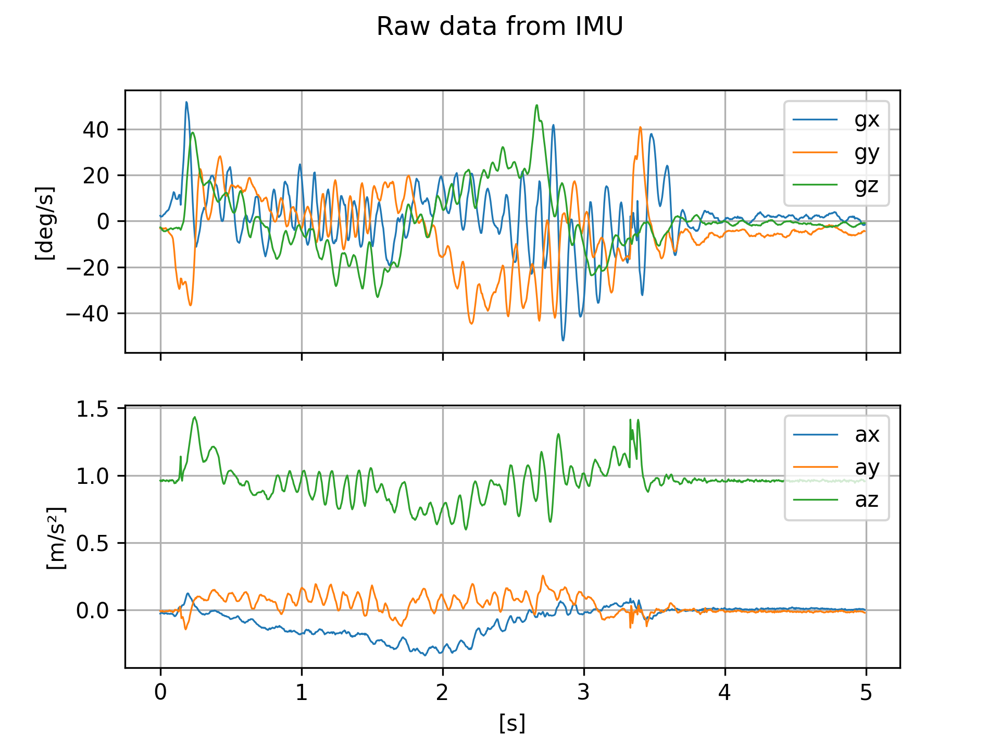
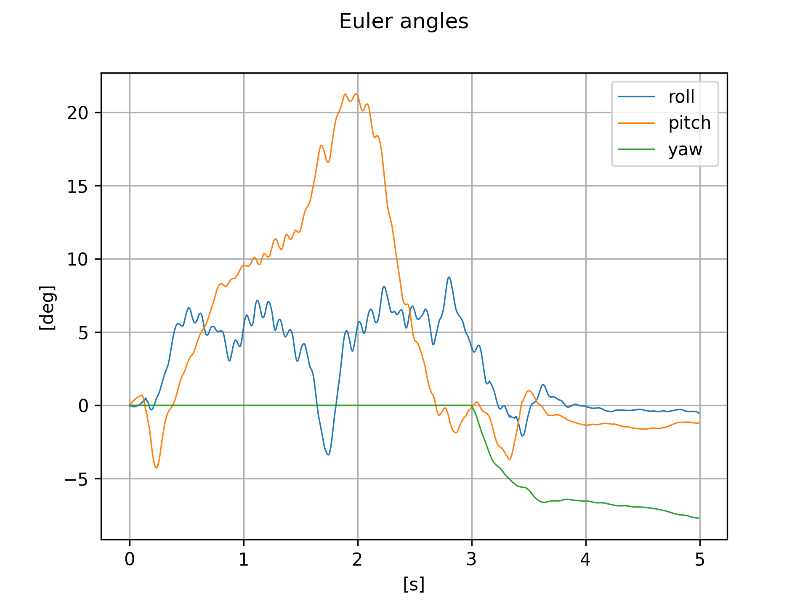
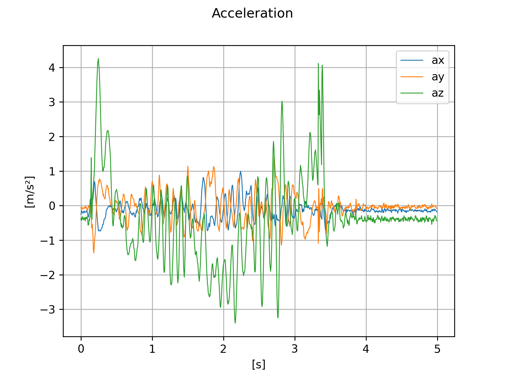
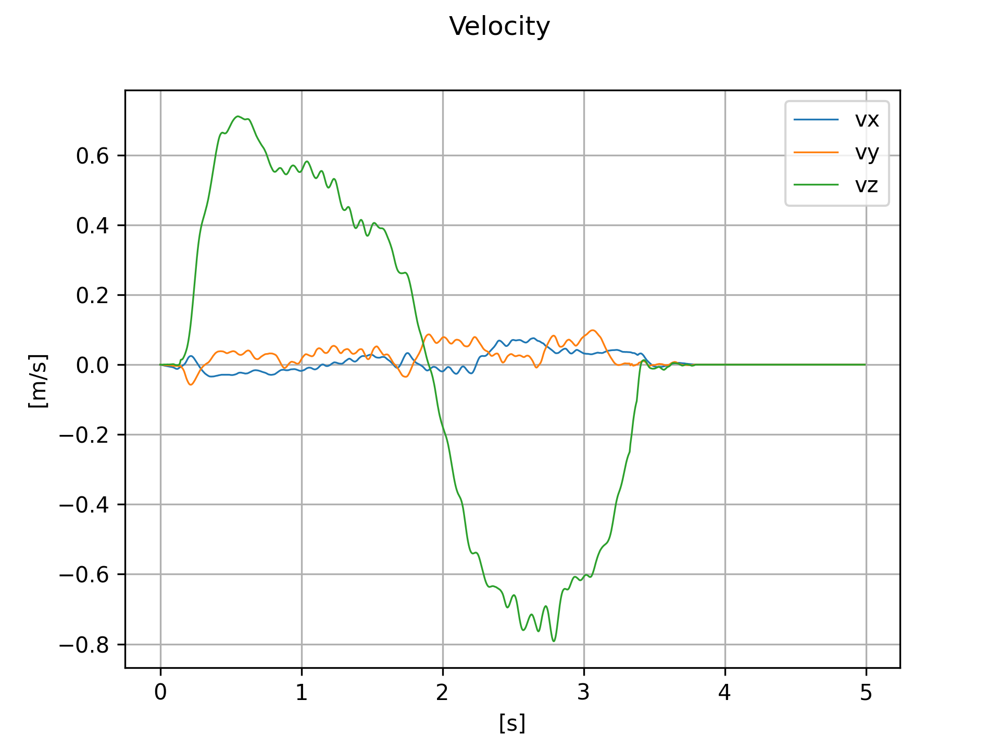
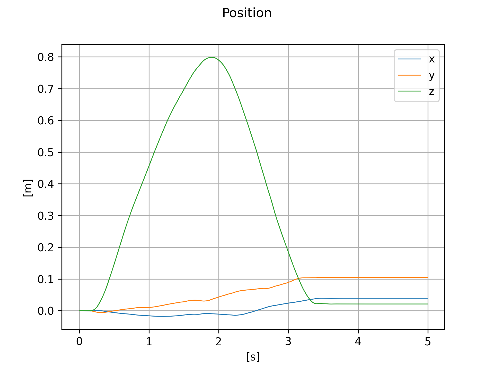
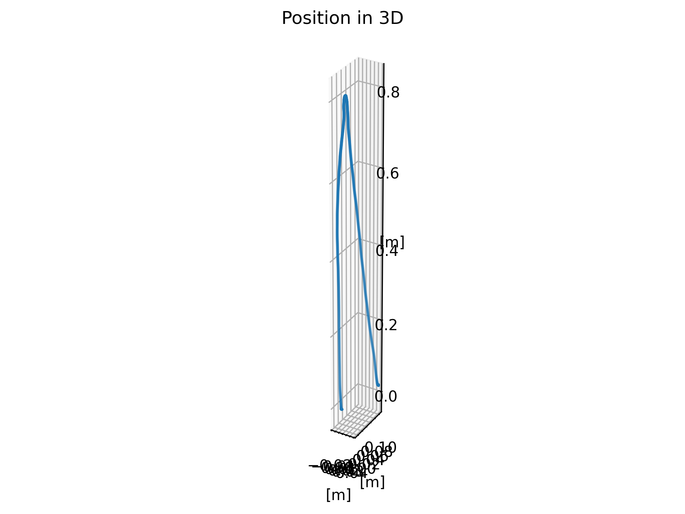

# Obsah

 - Vyčítání dat
 - Přenos dat do počítače
 - Zpracování do grafů
 - Průběh záznamu
 - Výsledky - přehled grafů

# 1. Vyčítání dat

 - ESP32
 - MPU9250
 - I2C

# 2. Přenos dat do počítače

 - UART
 - C++ (termios, termbits)

# 3. Zpracování dat

 - python
 - Madgwickův algoritmus (imufusion)
 - grafy (matplotlib)

# 4. Průběh záznamu dat

 (a) board.conf
 (b) program
 (c) data/

# 5. Grafy - Akcelerometr a gyroskop

{ width=100% }

# 5. Grafy - Eulerovy úhly

{ width=100% }

# 5. Grafy - Zrychelní

{ width=100% }

# 5. Grafy - Rychlost

{ width=100% }

# 5. Grafy - Pozice

{ width=100% }

# 5. Grafy - Pozice ve 3D

{ width=100% }

# Děkuji za pozornost, dotazy?
